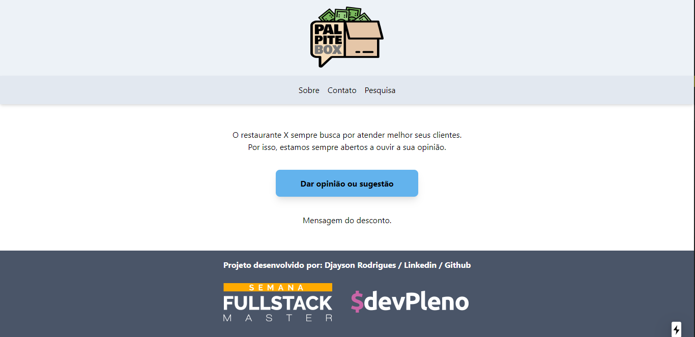

<p align="center"></img></p>
<h1 align="center">Semana Fullstack Master </h1>
<p align="center">Projeto <strong>PalpiteBox</strong> desenvolvido durante a Semana Fullstack Master</p>
<p align="center">O projeto que desenvolveremos durante o evento foi
apelidado de <strong>PalpiteBox</strong>. Uma caixa de sugestões na qual os
clientes podem deixar opiniões e sugestões sobre os
estabelecimentos comerciais e, em troca, receber cupons de
desconto e vantagens.</p>

<p align="center">
   <a aria-label="Versão do Node" href="https://github.com/nodejs/node/blob/master/doc/changelogs/CHANGELOG_V12.md#12.16.1">
    </img>
  </a>
  
   <a aria-label="Versão do Node" href="https://github.com/vercel/next.js/">
    </img>
  </a>
  
<a aria-label="Versão do React" href="https://github.com/facebook/react/blob/master/CHANGELOG.md#16131-march-19-2020">
    </img>
  </a>
  </p>


  ## Instalação 
Para instalar as dependências e executar o **PalpiteBox** você vai precisa do NodeJS e do NPM instalado em sua máquina, o outro passo é você clona o projeto em seu computador e em seguida execute:
```bash
cd PalpiteBox
npm install
npm run dev
```
## Colocando em produção:

Este projeto pode ser colocado em produção utilizando o Vercel. É necessário criar as variáveis de ambiente para configurar o acesso as planilhas do Google:

```
SHEET_CLIENT_EMAIL=client email do service credential
SHEET_PRIVATE_KEY=private key do service credential - lembrar de substituir \n por quebras de linha e de codificar em base 64
SHEET_DOC_ID=id da planilha
```
## Construido com:
* [NextJS](https://nextjs.org/) -The React Framework.
* [TailwindCSS](https://tailwindcss.com/) - A utility-first CSS framework for
rapidly building custom designs.
* [Figma](https://figma.com/) - Online prototyping tool.
* [Google Sheets](https://drive.google.com) - Planilhas online do Google

## Autor
**Djayson Rodrigues** - [LinkedIn](https://linkedin.com/in/djaysonrodrigues)

## Frontend

</img>
## Licença

[MIT](./LICENSE) &copy; [DevPleno](https://devpleno.com/)
